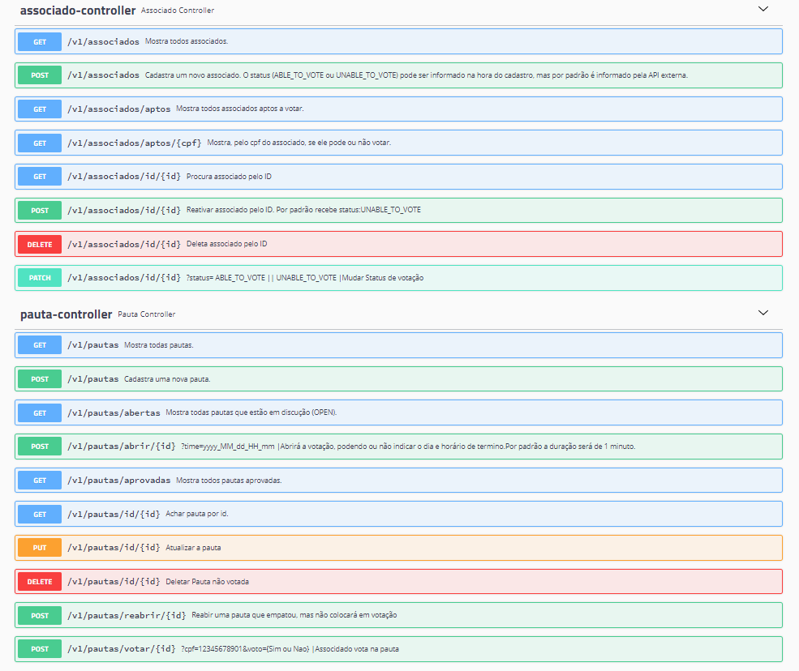

# DS Vendas
 

# Sobre o projeto

Exercício proposto pela IBM baseado em um dos testes aplicados pelo Sicredi envolvendo uma aplicação backend em Springboot.

##
 docker run -d -p 8080:8080 edmilsonemandrade/java-springboot-ibm-desafio

## Métodos Http

## Modelo conceitual

# Tecnologias utilizadas
## Back end
- Java
- Spring Boot
- JPA / Hibernate
- JUnit
- Maven
- Swagger
## Implantação em produção
- Banco de dados: Postgresql

# Como executar o projeto

## Back end
Pré-requisitos: Java 11

# Autor
Edmilson Emmanuel Moura Andrade

https://www.linkedin.com/in/edmilson-emmanuel-moura-andrade/
